# RAG From Scratch — Theory

Parts 1–4 explained in plain language, with diagrams and worked examples.

**RAG** stands for *Retrieval-Augmented Generation*. The idea is simple: a language model is only as good as what it has already read, and it has only read what it was trained on. RAG lets it answer from *your* documents instead — you keep your text in a form that can be searched, find the parts that matter for a question, and hand those parts to the model as context. The model then writes an answer grounded in that text rather than in its memory.

The rest of this document builds that idea up in four parts, one piece at a time: first a bird's-eye view of the whole chain, then indexing, then retrieval, then generation. Each section stays close to the ground, with a diagram and an example, so the reasoning is easy to follow even if you have never built one before.

## Contents

- [Why RAG exists](#why-rag-exists)
- [Two jobs: indexing and serving](#two-jobs-indexing-and-serving)
- [The big picture](#the-big-picture)
- [Part 1 — Overview](#part-1--overview)
- [Part 2 — Indexing](#part-2--indexing)
- [Part 3 — Retrieval](#part-3--retrieval)
- [Part 4 — Generation](#part-4--generation)
- [End to end](#end-to-end)
- [Parameters that matter](#parameters-that-matter)
- [Things to remember](#things-to-remember)
- [Glossary](#glossary)

## Why RAG exists

Before learning *how* RAG works, it helps to understand the problem it was invented to solve. A language model's knowledge is fixed the moment its training ends. Everything it "knows" is baked into its weights as a compressed, statistical impression of the text it saw — and that leads to four problems you meet almost immediately in real use.

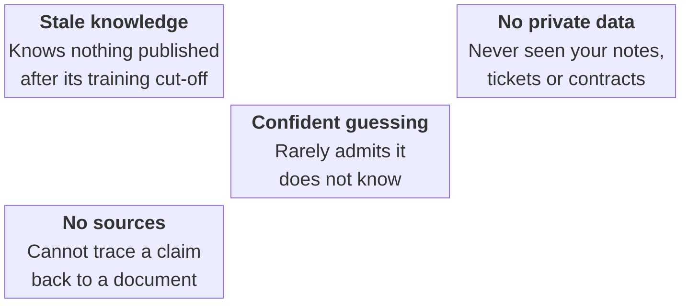

- **Stale knowledge** — The model has no idea anything was published after its training cut-off. Ask about a change made last week and it simply cannot know.
- **No private data** — It has never seen your notes, tickets, contracts or internal documentation. That information exists only in your systems, not in its weights.
- **Confident guessing** — When it doesn't know, it rarely says so. It produces something plausible-sounding instead — a "hallucination" that reads as fluently as a fact.
- **No sources** — Even when the answer is right, there is no way to check where it came from. You cannot trace the claim back to a document.

You might wonder why we don't simply teach the model new facts by fine-tuning it. Fine-tuning is good at shaping *style and form* — how the model writes, the tone it takes, the format it follows. But it is a poor tool for *facts*. It is slow and expensive to repeat, it cannot cite where an answer came from, and every time a single document changes you would have to retrain. RAG takes the opposite approach: leave the model as it is, and give it the right text at the moment it answers. Updating knowledge becomes as cheap as re-indexing one file, and the answer can point straight back at the text it used.

## Two jobs: indexing and serving

One of the most useful mental models in RAG is that there are really two separate jobs, running at different times, sharing a single store. The first job, **indexing**, runs once over all of your documents and prepares them to be searched. The second job, **serving**, runs every time someone asks a question: it searches what indexing prepared and produces an answer.

Keeping these apart matters because they have very different constraints. Indexing can take minutes or hours — it is a batch job you run in the background. Serving, by contrast, happens while a person waits, so it has to be fast. Both halves meet at one place: the vector store, which indexing writes to and serving reads from.

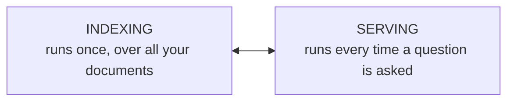

The two halves never call each other directly — they communicate through the vector store.

|  | Indexing | Serving |
|---|---|---|
| **When** | Offline, ahead of time | Online, per question |
| **Input** | All your documents | One question |
| **Output** | A searchable store | One answer |
| **Steps** | load → split → embed → store | embed → retrieve → generate |
| **Speed** | Can be slow (batch) | Must be fast (interactive) |

## The big picture

Put the two jobs together and you get the three phases that every RAG system shares. **Index** prepares the documents. **Retrieve** finds the parts relevant to a question. **Generate** turns those parts into an answer. The first phase happens once and offline; the other two happen together, live, for every question.

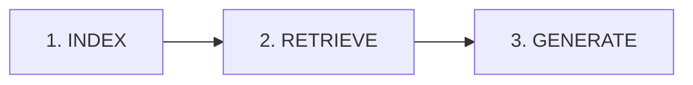

One line that tells the whole story. Parts 2, 3 and 4 take each phase in turn.

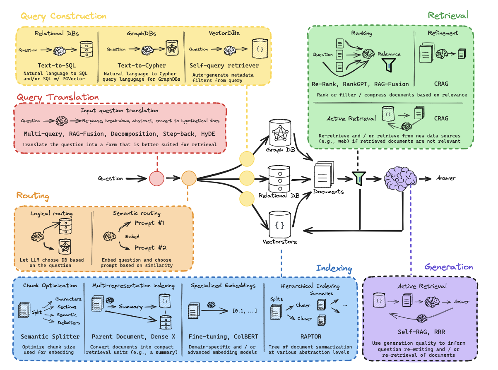

*The RAG landscape — we build the backbone: index → retrieve → generate.*

---

## Part 1 — Overview (the whole chain at once)

Before taking the system apart, it is worth seeing its shape whole. Part 1 runs the entire chain in a single pass, from a document to an answer, without worrying about the details of any one step. The point is to fix the overall picture in your mind before zooming in.

Read left to right, the chain is five small verbs. We load a document, split it into manageable pieces, turn those pieces into searchable form and store them, ask a question, and get an answer. That is the whole of RAG; everything else in this document is just a closer look at one of those verbs.

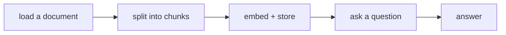

In code, all five steps collapse into one plain function: `rag(question)`.

If you look inside that function, only two things are really happening at answer time: it finds the relevant chunks, and it asks the model to answer using them. The first three verbs — loading, splitting and storing — are preparation that happens once. The last two are the live part that runs per question.

### Environment

Nothing here needs a cloud account or an API key. You install a handful of packages once and run a language model locally on your own machine. That keeps the whole pipeline self-contained and reproducible.

```bash
pip install requests trafilatura chonkie sentence-transformers chromadb ollama jinja2
```

> **Running example.** To keep the ideas concrete, this document uses one example throughout. We index a single blog post and then ask the question *"What is Task Decomposition?"* A good answer should be built only from the parts of that post we retrieved — nothing fetched from the model's general memory. Each section below quietly feeds this same example, so by the end you have watched it come together step by step.

---

## Part 2 — Indexing

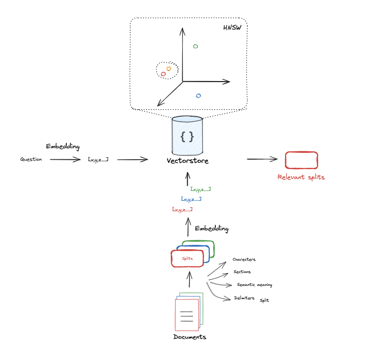

*Indexing: documents are split, embedded, and stored.*

Indexing is the preparation stage. Its goal is simple to state: take your raw documents and turn them into something that can be searched by meaning, quickly and reliably. It runs ahead of time — usually as a batch job — so that when a real question arrives later, the system does not have to touch the original documents at all. It only has to search the prepared store.

Indexing is itself four steps, and each one solves a specific problem. We **load** the raw text and clean it. We **split** it into chunks small enough to work with. We **embed** each chunk into numbers that capture its meaning. And we **store** those numbers so they can be looked up later. The next seven sections walk through them, beginning with the most basic ingredient of all: the document itself.

### 2.1 Documents

A "document" is just the raw text you want the system to know about. It can arrive from almost anywhere — a web page, a markdown file, a PDF, a support ticket, a row in a database. At this stage we don't care about its format or meaning; we care that it is **text, plus a little metadata** describing where it came from. That metadata might be a URL, a title, a file name, or a date.

It is worth separating two words that are easy to confuse. A **document** is the whole thing — the entire page or file. A **chunk** is a piece of it, which we will create in a moment. We keep both: the searchable store indexes chunks, but each chunk remembers which document it came from, so a final answer can point back to its source.

> **Example.** In the smallest possible case, a document is a single sentence, and a question is a single sentence too:
>
> question = *"What kinds of pets do I like?"*
> document = *"My favorite pet is a cat."*
>
> With just these two lines we can demonstrate every step from here to an answer, without the noise of real documents getting in the way.

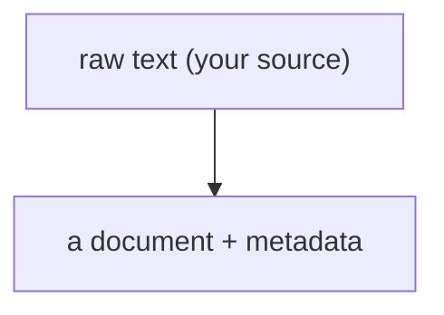

### 2.2 Token counting

Here is a fact that surprises most people: language models don't read characters, and they don't read whole words either. They read **tokens**, which are pieces of words. A short common word like "cat" is one token; a longer or rarer word might be split into two or three. Even punctuation gets its own token. Counting tokens is how we measure text in the units the model actually understands.

That count matters for three practical reasons. First, every model has a **context window** — a maximum amount of text it can take in at once — and the prompt, the retrieved context and the answer all have to fit inside it together. Second, chunks are measured in tokens, so the count is what lets us size them sensibly. Third, tokens translate directly into speed and, on paid runtimes, cost: more tokens per request means slower answers.

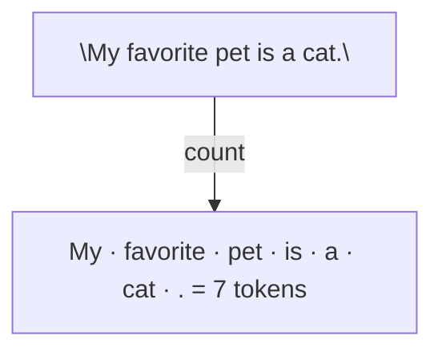

> **Use the model's own tokenizer.** A token count is only correct for the tokenizer that produced it. Count with a different model's tokenizer and you will mis-size chunks and mis-estimate how much room is left in the context window.

> **Example.** As a rough rule of thumb, one token is about four characters of English, so a thousand characters is roughly 250 tokens. That is fine for a quick mental estimate, but before anything is sized for real, confirm the count with the actual tokenizer of the model you will use.

### 2.3 Embeddings

An **embedding** is the trick that makes search work by meaning rather than by matching exact words. It turns a piece of text into a list of numbers — a vector — that captures what the text is about. Texts with similar meaning end up as nearby vectors, even when they share no words at all. This is why a search for "how do I do X" can find a passage that talks about X without ever using the phrase.

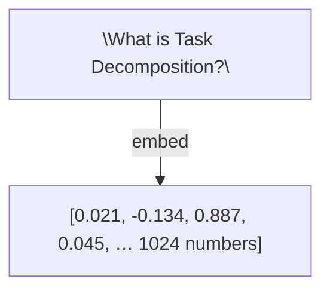

Each piece of text becomes a fixed-length vector — here, **1024 numbers**.

A few properties are worth knowing before you rely on embeddings. Every model produces a vector of a fixed length — this one always gives 1024 numbers — and that length is a property of the model. Different models give different lengths, and crucially, their vectors are *not* interchangeable: you cannot embed with one model and search against vectors made by another. Vectors are usually scaled to length one ("normalised"), which makes comparing them simple and stable. During indexing you embed many chunks in a batch; at answer time you embed just the one question. And because these models are relatively small, they run comfortably on a CPU, with a GPU only speeding up a large indexing run.

```python
SentenceTransformer("Qwen/Qwen3-Embedding-0.6B").encode(texts)  # runs locally, on CPU or GPU
```

### 2.4 Cosine similarity

Once text is numbers, comparing two pieces of text becomes a matter of comparing two vectors. The standard way to do that for text is **cosine similarity**, which measures the *angle* between the vectors. It deliberately ignores how long each vector is and cares only about the direction it points, which turns out to suit language very well: two texts about the same idea point the same way, regardless of whether one is a short phrase and the other a long paragraph.

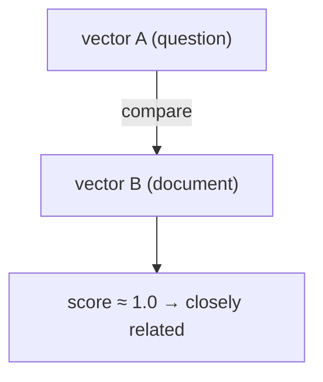

The score runs from `1`, meaning the vectors point exactly the same way and the texts are essentially identical in meaning, down toward `0` for unrelated texts. In practice the useful signal lives in a fairly narrow band at the top.

| Score | Meaning |
|---|---|
| `1.0` | Same direction — nearly identical meaning |
| `~0.7–0.9` | Clearly related |
| `~0.3–0.6` | Loosely related |
| `~0.0` | Unrelated |

> **Example.** Comparing the embedding of the question with the embedding of the document gives a high score, because they are about the same thing. A sentence about cooking would score far lower. That gap is exactly what retrieval exploits: the chunks with the highest scores are the ones most likely to answer the question.

### 2.5 Document loaders

Real sources are messy. A web page is mostly menus, adverts, cookie banners, navigation and footers wrapped around a small core of actual article text. If you embed all of that noise, you pollute the store with irrelevant material and dilute the answers. A **loader** exists to prevent that: it fetches the source and keeps only the meaningful text.

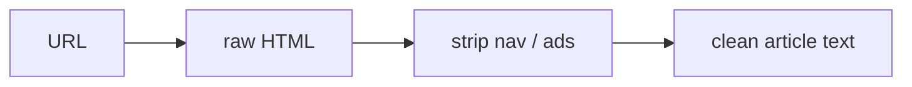

A good loader does three things. It extracts the main content and drops the boilerplate. It attaches metadata — the source URL or file name, a title, perhaps a date — which will be carried forward onto every chunk so answers can cite their origin. And it normalises whitespace and encoding, so the same text always looks the same no matter how it arrived.

```python
trafilatura.extract(requests.get(url).text)  # fetches a page and keeps only the main article
```

### 2.6 Splitting (chunking)

Long documents have to be broken into smaller pieces, called **chunks**. This is not a cosmetic step — the chunk is the unit that gets embedded, retrieved and handed to the model, so where you draw its boundaries shapes everything downstream. We split for three reasons.

First, **precision**. A small, focused chunk that genuinely matches the question beats a whole page that only sort of matches, because the model is handed less irrelevant text to wade through. Second, **fit**: chunks must be able to sit inside the model's context window alongside the prompt. Third, boundaries themselves can do harm, so chunks usually **overlap** slightly. A sentence that happens to fall on a cut can otherwise be split in half and lose its meaning; a small overlap keeps that context intact.

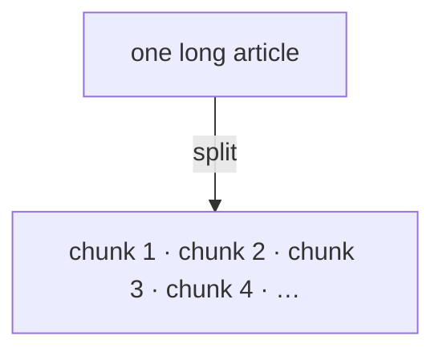
e.g. `chunk_size = 300 tokens`, `chunk_overlap = 50`

Chunk size is a trade-off, and it is worth internalising. Small chunks give precise matches but may leave out the surrounding context needed to understand them. Large chunks carry more context but dilute relevance and eat into the context window. There is no universal best size; it depends on your documents, so it is a parameter you tune.

| Chunk size | Good | Bad |
|---|---|---|
| Small | Precise matches | May miss surrounding context |
| Large | More context per chunk | Dilutes relevance, wastes window |

> chonkie's `RecursiveChunker` splits by **tokens** using the model's tokenizer, trying paragraph, then sentence, then word boundaries before resorting to a hard cut.

### 2.7 Vector store

The last step of indexing is to save the results. A **vector store** holds each chunk together with its vector, so that later we can ask a simple question of it: which chunks are closest to this new question? Think of it as a library you build out of your own documents, organised by meaning rather than alphabet.

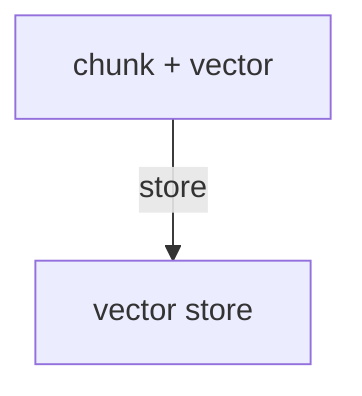
Later: store the question's vector too, and find nearest neighbours.

| id | chunk (text) | vector |
|---|---|---|
| `doc:0` | "Task decomposition is…" | `[0.02, -0.13, …]` |
| `doc:1` | "ReAct combines reasoning…" | `[0.41, 0.08, …]` |
| `doc:2` | "Memory keeps context…" | `[-0.22, 0.55, …]` |

A few details make a vector store pleasant to live with. Searching for the nearest vectors is done with a structure built for it — often something called HNSW — so it stays fast even with many chunks, rather than comparing the query against every vector one by one. You can filter by metadata, for instance to search only within one file. Chunks are stored under **stable ids**, derived from the source and position, so that re-running indexing updates existing entries instead of creating duplicates. And the store is **persistent**: it lives on disk, so you don't rebuild it every time you start the program.

```python
chromadb.PersistentClient()  →  collection.add(ids, documents, embeddings, metadatas)
```

---

## Part 3 — Retrieval

With the store built, we reach the live half of the system. Retrieval answers a single question: *which chunks are most relevant to what was just asked?* The method is the same idea we used to build the store, run in reverse. We embed the question with the same embedding model, then look for the chunks whose vectors are nearest to the question's vector. The handful of closest chunks — the "top-k" — are what get passed on.

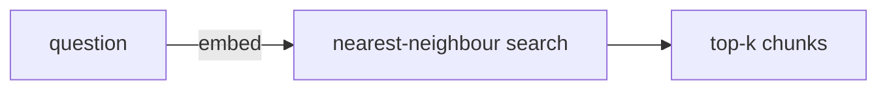
`collection.query(query_embeddings=[…], n_results=k)`

The one number to choose here is `k` — how many chunks to retrieve. It is a genuine trade-off. Retrieve too few and the correct chunk may never make it into the context, making a good answer impossible. Retrieve too many and you flood the model with loosely related text, which dilutes the signal and crowds the context window.

| k | Effect |
|---|---|
| Too small (1–2) | Fast, but risks missing the answer |
| Balanced (4–6) | Usually the sweet spot |
| Too large | Adds noise and fills the context window |

> **Example.** Asking *"What is Task Decomposition?"* with `k=1` returns the single most relevant chunk. Raising it to `k=5` gives the model several chunks to draw on, which often helps when an answer is spread across more than one passage.

> **Retrieval is the heart of RAG.** No model can produce a correct answer if the right chunk never reaches it. In practice, most improvements in answer quality come from better retrieval — better chunks, a better embedding model, a better `k` — rather than from a larger language model.

The retrieved chunks are then gathered together, usually reordered with the most relevant first and trimmed to fit the token budget, before being passed to the final stage.

## Part 4 — Generation

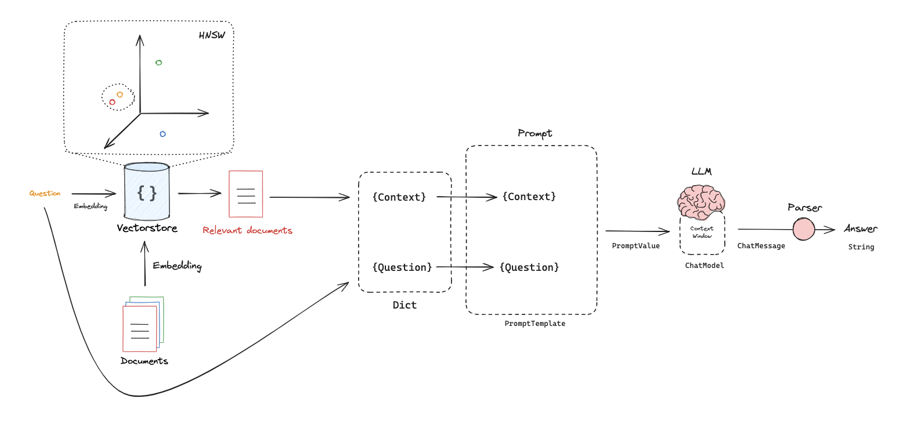

*Generation: retrieved context plus the question go into the model.*

This is the stage that gives RAG its name. The chunks retrieved in Part 3 are placed into a **prompt** alongside the question, and the language model writes an answer *from that context*. This is the "Generation" in Retrieval-Augmented Generation, and it is what makes the answer grounded: the model is now working from your documents rather than reaching into its memory.

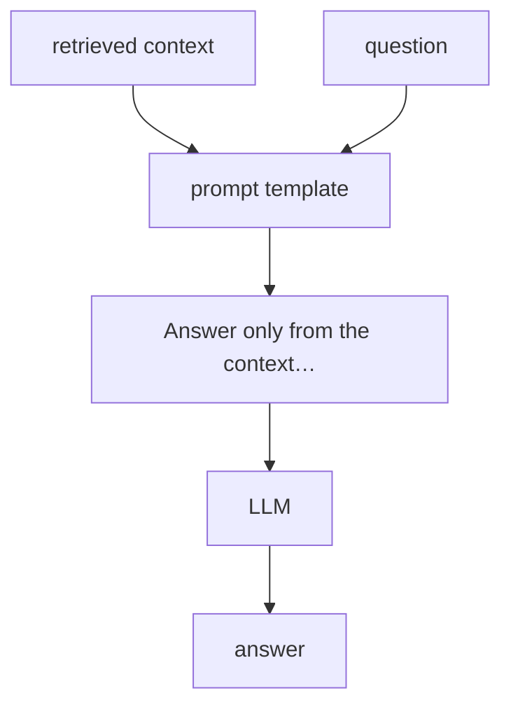

Most of the craft in this stage lives in the prompt. A good one asks for three things. It asks the model to **ground** itself — "answer only from the context" — which reduces invented facts. It asks for **citations** — "point to the source of each claim" — which makes answers checkable. And it gives the model permission to be honest: "if the context does not contain the answer, say so". That last instruction is easy to forget and quietly prevents a lot of confident nonsense.

#### Settings that matter at generation time

A few parameters shape the output. Temperature controls randomness — at zero the model is focused and repeatable, and higher values make it more varied (though even at zero, it is not perfectly deterministic). A cap on answer length both keeps replies concise and reserves room in the context window. And the context window itself is the total budget shared by the prompt, the context and the answer; its size depends on the model, so it is worth checking rather than assuming.

| Setting | Effect |
|---|---|
| temperature | 0 = focused and repeatable; higher = more varied (not fully deterministic) |
| max answer tokens | Caps answer length and reserves space in the context window |
| context window | Total budget for prompt + context + answer; verify per model |

> **Example prompt.** *"Answer the question based only on the following context: {context}. Question: {question}"*
>
> The retrieved chunks fill `{context}`, the user's question fills `{question}`, and the model's reply is the answer.

> The prompt is built from a Jinja2 template and generation runs through a local model with `ollama.chat(model="gpt-oss:20b", messages=[…])` — both wrapped up in one plain `rag(question)` function.

---

## End to end

It is worth seeing the whole thing in one view now that each piece has been explained. Indexing runs once along the top, turning documents into a store. Then, for each question, the flow drops into the serving half along the bottom: embed the question, retrieve the nearest chunks, build the prompt, and generate the answer.

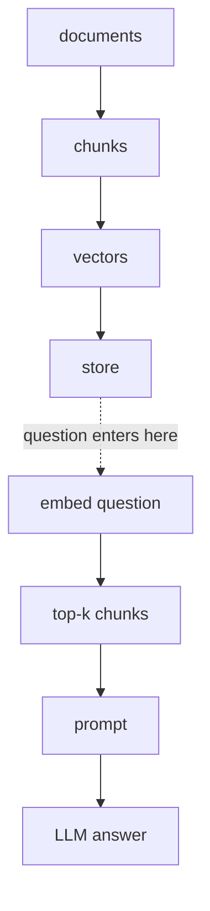

Index once at the top; retrieve and generate for every question.

> **The running example, start to finish**
>
> 1. Load the blog post and clean it down to its main text.
> 2. Split it into chunks of roughly 300 tokens, with a small overlap.
> 3. Embed every chunk and add them to the store with their metadata.
> 4. Ask *"What is Task Decomposition?"* and embed that question.
> 5. Find the top-k chunks whose vectors are nearest to it.
> 6. Build the prompt from those chunks plus the question, and generate an answer that cites its source.

## Parameters that matter

A handful of numbers shape the behaviour of the whole pipeline. None has a single correct value — they are dials you adjust to your documents — but these are sensible starting points.

| Parameter | Typical value | What it controls |
|---|---|---|
| `chunk_size_tokens` | 300–512 | How much text per chunk |
| `chunk_overlap_tokens` | 10–20% of size | Context carried across boundaries |
| `k` | 4–6 | How many chunks are retrieved |
| `temperature` | 0 | Randomness of generation |
| `context_window` | model-specific | Total prompt + context + answer budget |
| `max_answer_tokens` | 512–1024 | Cap on answer length |

## Things to remember

Most of what goes wrong in a RAG system comes down to a small set of mistakes. These are the ones worth keeping in mind.

1. **Re-embed when the embedding model changes.** Different models produce vectors of different length, and their vectors are not compatible. Changing the model means rebuilding the entire store from scratch — old vectors cannot be reused.
2. **Use the model's own tokenizer.** A token count is only correct for the tokenizer that produced it. Count with something else and your chunks will be the wrong size and your context budget wrong.
3. **Chunk size × k must fit the context window.** Context is not free. Larger chunks and more of them push other text out of the window and make the answer slower.
4. **Retrieval quality beats model size.** Better chunks and a better `k` usually improve answers more than a larger language model reading poor context would.
5. **Grounding is not a guarantee.** The model can still drift outside the context. Prompt it explicitly to say "I don't know" when the answer is not there.

## Glossary

- **Chunk** — a piece of a document; the unit that is embedded, retrieved and shown to the model.
- **Context window** — the maximum amount of text, measured in tokens, a model can take in at once.
- **Embedding** — a fixed-length numeric vector representing the meaning of a piece of text.
- **Cosine similarity** — a score from -1 to 1 for how similar two vectors are in direction.
- **Vector store** — a collection of chunks and their vectors, built for nearest-neighbour search.
- **Top-k** — the k most similar chunks returned for a query.
- **Grounding** — forcing the model to answer from the supplied context rather than from memory.
- **Hallucination** — a confident but unsupported or false model answer.

---

*Theory overview only — no implementation here. This document follows the flow of a from-scratch RAG walkthrough, laid out in four parts: overview, indexing, retrieval and generation. The runnable version lives in [`../notebooks/open_rag_from_scratch_1_to_4.ipynb`](../notebooks/open_rag_from_scratch_1_to_4.ipynb).*
